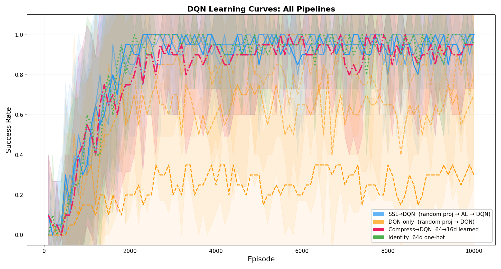
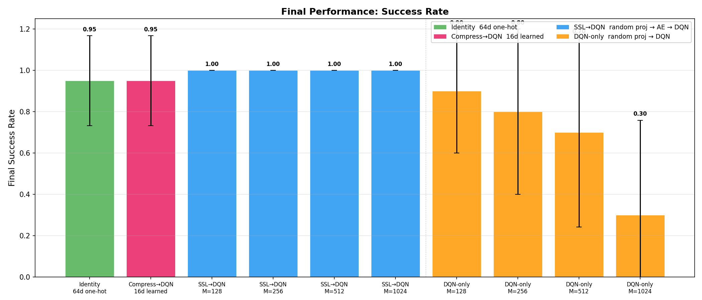

# SLAI-RL-Final

**Observation Dimension & SSL Pretraining for DQN Sample Efficiency**

期末研究项目：观测维度对 DQN 样本效率的影响，及自监督预训练 Encoder 的作用。

---

## Research Question

| Dimension | Question |
|-----------|----------|
| **Primary** | How does the state encoding dimension M ∈ {128, 256, 512, 1024} affect DQN sample efficiency? |
| **Secondary** | Under the same M, does a **self-supervised pretrained encoder** outperform a **random frozen encoder**? |
| **Baseline** | Identity — DQN directly on 64-dim one-hot state (theoretical upper bound) |

**Core Constraint**: The agent never sees the true 64-dim one-hot state during training. The state is projected through a frozen random MLP (64→M) into an M-dim observation — only this projected observation is visible to the agent.

## Pipeline

```
True state s (64-dim one-hot)          ← environment internal, NEVER seen
        │
        │  Frozen random MLP E: 64→M
        ▼
Observation obs (M-dim)                 ← agent's only input
        │
   ┌────┴────────────────┐
   │ Pipeline 1 (SSL→DQN) │   Pipeline 2 (DQN-only)
   │                      │
   │ SSL Encoder          │   (no SSL)
   │ E_ssl: M→64          │
   │ (trained)            │
   │                      │
   │ Decoder D_ssl: 64→M  │
   │ Loss = ‖obs - D(E(obs))‖²
   │                      │
   ▼                      ▼
   z (64-dim)            obs (M-dim)
   (learned latent)      (raw projection)
   │                      │
   └────┬─────────────────┘
        ▼
    DQN input → 256 → 256 → 4
```

## Pipelines

| Pipeline | Encoder | SSL Stage | DQN Input |
|----------|---------|-----------|-----------|
| **SSL→DQN** | Random MLP E: 64→M (frozen) | Train autoencoder M→64→M, freeze encoder | 64-dim SSL latent |
| **DQN-only** | Random MLP E: 64→M (frozen) | None | M-dim raw observation |
| **Identity** | None (direct one-hot) | None | 64-dim one-hot |

## Experiment Matrix

- **4** × observation dimensions M: `{128, 256, 512, 1024}`
- **3** × pipelines: `ssl_dqn`, `random_dqn`, `identity`
- **5** × seeds per condition
- **= 60 experiments total**

## Results

### Sample Efficiency

| M | SSL-DQN | Random DQN | Identity |
|---|---------|------------|----------|
| 128 | — | — | — |
| 256 | — | — | — |
| 512 | — | — | — |
| 1024 | — | — | — |

### Learning Curves



### Final Performance



## Project Structure

```
.
├── rlfinal/                    # Main Python package
│   ├── algorithms/             # SSL pretraining, Double DQN, replay buffer
│   ├── models/                 # Encoder, Decoder, Q-Network
│   ├── experiments/            # Pipeline runners (ssl_dqn, random_dqn, identity)
│   ├── analysis/               # Learning curves, efficiency plots, statistics
│   └── utils/                  # Config, logger, seed management
├── paper/                      # LaTeX paper & figures
├── results/                    # Experiment output JSONs
├── review/                     # Peer review materials
├── analysis_output/            # Generated plots (PNG/PDF)
├── launch_all_2gpu.sh          # Launch all experiments on 2 GPUs
├── launch_4gpu.sh              # Launch on 4 GPUs
└── shared/                     # Chen-Research Skills shared library
```

## Environment

- **Hardware**: H100 80GB GPU
- **GridWorld**: 8×8, 64 one-hot states, 4 actions
- **Optimal path**: 14 steps (BFS)

## Quick Start

```bash
# Install dependencies
pip install torch numpy matplotlib pyyaml tqdm

# Run single experiment
python -m rlfinal.run_one --pipeline ssl_dqn --M 128 --seed 0

# Run all experiments (60 configs)
bash launch_all_2gpu.sh

# Generate analysis plots
python -m rlfinal.analysis.plot_curves
python -m rlfinal.analysis.plot_efficiency
```

## Double DQN Hyperparameters

| Parameter | Value |
|-----------|-------|
| Discount γ | 0.99 |
| Learning rate | 1e-3 |
| Batch size | 64 |
| Replay buffer | 10000 |
| ε-greedy | 1.0 → 0.05 (linear decay over first 20% episodes) |
| Target update | Every 100 steps |
| Total episodes | 5000 |
| Eval frequency | Every 50 episodes (10 eval episodes) |

## Key Design Decisions

- **True state `s` is never exposed** to the agent during training
- SSL autoencoder uses **M-dim reconstruction loss** (self-supervised, no `s` or reward)
- The 64-dim SSL latent **is not** the true state — it's a learned compression
- Unified DQN architecture: `input → 256 → 256 → 4`
- Random encoder E is frozen and shared across all experiments at the same seed

## License

MIT
